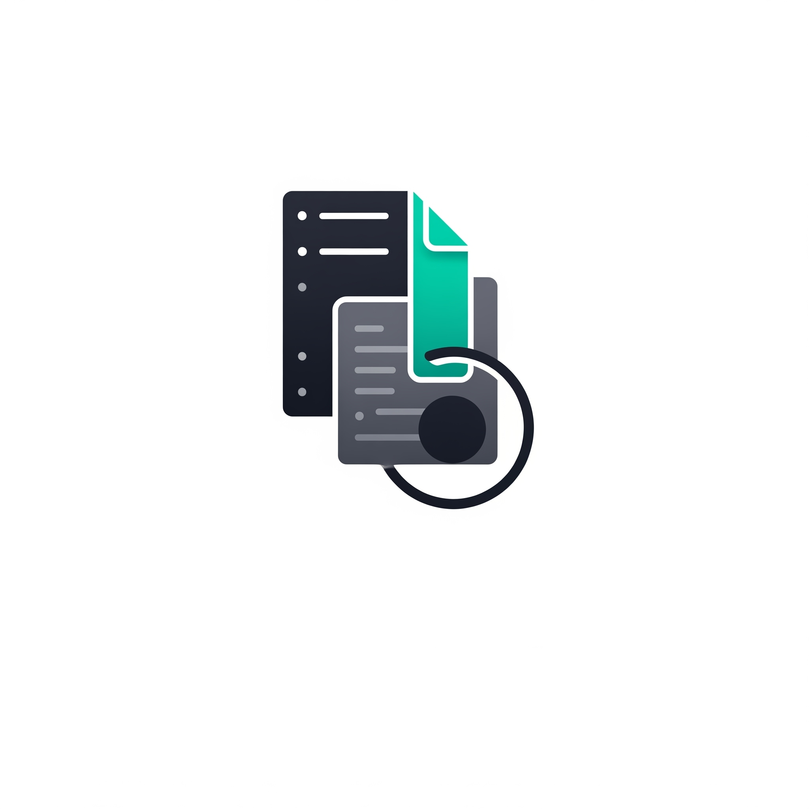

# Go-CodeCheck Desktop

<p align="center">
  
</p>

## Overview

Go-CodeCheck Desktop is a cross-platform application that performs security scanning on code repositories using Semgrep. Built with Go and Svelte, it provides an intuitive interface for running security scans on local code directories and reviewing the scan results.

## Features

- **Local Code Scanning**: Scan any local directory for security vulnerabilities
- **Semgrep Integration**: Powered by Semgrep's powerful static analysis engine
- **Docker-based Execution**: No need to install Semgrep locally
- **Detailed Reports**: View comprehensive vulnerability reports with severity ratings, CWE references, and more
- **Scan History**: Keep track of previous scans and their results
- **Cross-Platform**: Works on Windows, macOS, and Linux

## Prerequisites

- [Docker](https://www.docker.com/get-started) installed and running
- The [Semgrep Docker image](https://hub.docker.com/r/semgrep/semgrep) (`docker pull semgrep/semgrep:latest`)

## Installation

### From Releases

1. Download the latest release for your platform from the [Releases](https://github.com/your-username/go-codecheck-desktop/releases) page
2. Extract the archive (if applicable)
3. Run the application executable

### Building from Source

1. Clone the repository:
   ```
   git clone https://github.com/your-username/go-codecheck-desktop.git
   cd go-codecheck-desktop
   ```

2. Install [Wails](https://wails.io/):
   ```
   go install github.com/wailsapp/wails/cmd/wails@latest
   ```

3. Install frontend dependencies:
   ```
   cd frontend
   npm install
   cd ..
   ```

4. Build the application:
   ```
   wails build
   ```

   The built application will be in the `build/bin` directory.

## Development

### Live Development

To run in live development mode:
```
wails dev
```

This will run a Vite development server that provides hot reload for frontend changes. You can also access the application in your browser at http://localhost:34115, which gives you access to Go methods from the browser's devtools.

### Project Structure

- `/app.go`: Main application entry point
- `/backend/`: Go backend code
  - `/core/`: Core functionality
    - `/docker/`: Docker integration
    - `/semgrep/`: Semgrep scanning implementation
    - `/reports/`: Report storage
  - `/pkg/`: Utility packages
    - `/parser/`: Report parsing utilities
    - `/utils/`: General utilities
- `/frontend/`: Svelte frontend code
  - `/src/`: Source code
    - `/components/`: Svelte components
    - `/views/`: Page views
    - `/stores/`: Svelte stores
    - `/assets/`: Static assets

## Usage

1. Launch the application
2. Ensure Docker is running (the app will check this for you)
3. Navigate to the Scan tab
4. Enter the absolute path to the directory you want to scan
5. Click "Start Scan" and wait for the scan to complete
6. Review the scan results in the History tab
7. Click "Details" to view comprehensive information about each scan

## How It Works

1. The application copies the target directory to a temporary location
2. It runs Semgrep via Docker in this temporary location
3. Semgrep generates a JSON report with scan results
4. The application parses and displays these results in a user-friendly format

## Contributing

Contributions are welcome! Please feel free to submit a Pull Request.

1. Fork the repository
2. Create your feature branch (`git checkout -b feature/amazing-feature`)
3. Commit your changes (`git commit -m 'Add some amazing feature'`)
4. Push to the branch (`git push origin feature/amazing-feature`)
5. Open a Pull Request

## Acknowledgments

- [Semgrep](https://semgrep.dev/) for the powerful code scanning engine
- [Wails](https://wails.io/) for the Go/Svelte desktop application framework
- [Svelte](https://svelte.dev/) for the reactive UI framework
- [Tailwind CSS](https://tailwindcss.com/) and [DaisyUI](https://daisyui.com/) for styling
